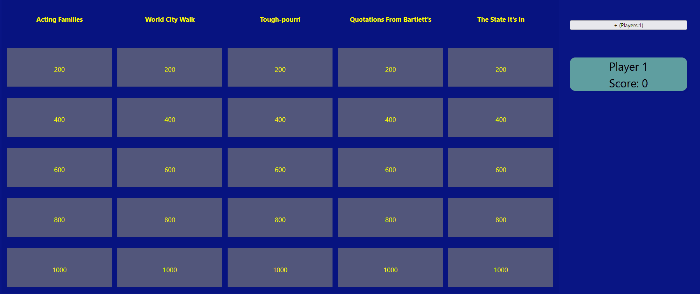

## Live Site:

[Play Jeopardy Here!](https://brandon-schefstad-jeopardy.netlify.app/)

React site using [jservice API](https://jservice.io/). Functional up to four players and allows for correct/incorrect answers.

## How It's Made:

**Tech used:** HTML, CSS, JavaScript, React, UseState/UseEffect, SASS
